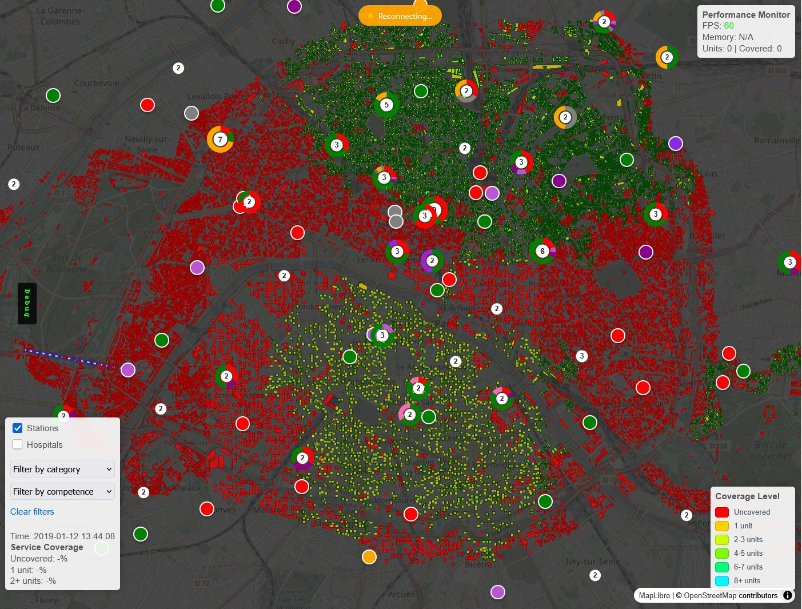
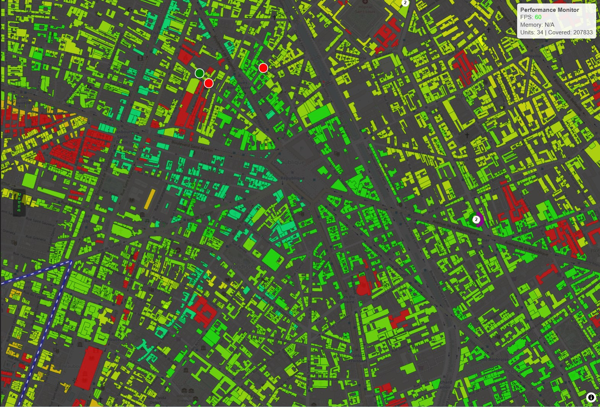
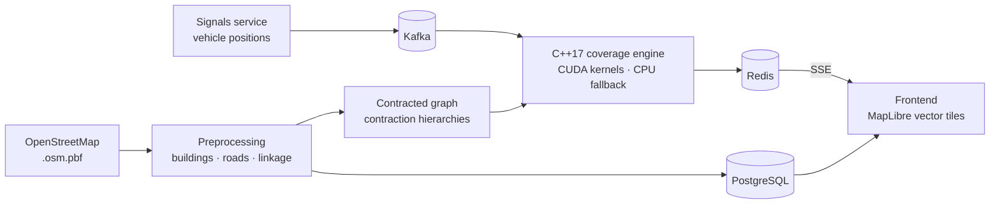

# Coverage Management System

**Real-time, building-level coverage intelligence for emergency services.**

Emergency dispatchers work from a static sector map — 77 sectors for the whole of Paris —
plus their own experience. Nothing tells them which *streets* are actually covered right
now, which units are reachable within the response target, or what moving one station
would do to coverage. On a cardiac arrest, that blind spot is measured in minutes.

This system answers the question continuously, at the granularity of a single building,
over a full road network, while vehicles are moving.



*Coverage across Paris, recomputed as units move. Every building is coloured by
how many units can actually reach it within the response budget — red is
uncovered, cyan is eight or more. The circles are stations, numbered by units
available. Compare that to the legacy operational picture: 77 static sectors.*

> **Status: R&D prototype.** Technically complete and running on five cities, but never
> deployed in live operations.
>
> **No operational data ships with this repository, by design.** The road network comes
> from OpenStreetMap; all vehicle activity is produced by the included simulator. Real
> vehicle position and status feeds belong to the services that operate them and are not
> published here — the code reads such a feed from Kafka, it does not contain one.

---

## What makes it hard

Coverage is not a circle on a map. A unit 400 m away across a river is not 400 m away.
Answering *"is this building covered?"* honestly means computing an actual road-network
travel time from every candidate vehicle — and doing it again every time a vehicle moves.

For Île-de-France that is **3.3M buildings against 464k road segments**, re-scored
continuously. The naive approach does not finish; a managed routing service costs more
per query than the budget for the entire system.



*Zoomed in, the unit of analysis is a single building, not a sector or a radius.
Instrumented run: a coverage rebuild over ~46k candidate buildings resolves in
**19 ms**, a viewport refresh of 4.5k features in **94 ms**, 207k buildings
covered in view, held at **60 FPS**.*

## How it works



**Routing — contraction hierarchies (RoutingKit, C++17).** Building-level isochrones over a
full road network need sub-50 ms route queries. Plain PostGIS routing and managed services
do not get there. The graph is contracted once, offline, then queried millions of times.

**Coverage — CUDA kernels with automatic CPU fallback.** The per-building distance
thresholding and capacity computation are embarrassingly parallel and became the
bottleneck once routing was fast. Moving the hot loop to the GPU was the answer; the
system still runs correctly, just slower, on a machine without a CUDA device.

**Streaming — deliberately thin.** `Kafka → C++ → Redis → SSE`. No stream-processing
framework, no message broker cluster to babysit: enough to hold end-to-end latency under
a second from a position update to a repainted map.

**Dynamic threshold.** The coverage target is not a constant. Mobilisation time — the delay
between a crew being alerted and the vehicle actually departing — varies by hour of day, so
a LightGBM model feeds an hourly profile and the travel-time budget is adjusted
accordingly. A 10-minute target at 03:00 does not mean the same reachable area as at 14:00.

## Multi-city

The pipeline is city-agnostic: a new city is a data run, not a rewrite. Five are
configured — Paris / Île-de-France, Annecy, Andorra, Vaduz, San Marino — each with its own
preprocessing config, signals service, Kafka topics and backend workers.

## Services

| Service | Role |
| --- | --- |
| `preprocessing` | OSM extraction: buildings, roads, building↔segment linkage, vector tiles |
| `backend` | C++17 routing and coverage engine, geo and record workers |
| `signals` | Vehicle position and status stream (one instance per city) |
| `frontend` | Flask app, MapLibre map, SSE consumer, simulation wizard, ML models |
| `postgres` · `kafka` · `redis` | Storage, transport, live state |

## Running it

```bash
docker compose up -d --build          # full stack
docker compose logs -f backend        # watch the engine
```

Then open the frontend and pick a city. `adminer` is exposed on `:8081` for a look at the
database.

Preparing a new city means writing a `services/preprocessing/config_<city>.py` and running
the extraction pipeline (`extract_roads.py`, `extract_buildings.py`,
`link_buildings_to_segments.py`, then the tile generators) against that city's
`.osm.pbf`.

GPU acceleration needs the NVIDIA Container Toolkit; without it the backend logs the CPU
fallback and keeps working.

## Stack

C++17 · RoutingKit · CUDA · Apache Kafka · Redis · PostgreSQL · Python · Flask · LightGBM ·
MapLibre GL JS · Docker · Server-Sent Events · OpenStreetMap

## Origin

This started as my CNAM engineering thesis in 2017 — modelling optimal resource deployment
for emergency services — and I have kept coming back to it since. An earlier phase was
presented at [Mission Critical Technologies, London Tech Week
2019](https://tmt.knect365.com/mission-critical-technologies/speakers/benjamin-berhault/),
and the response-time modelling groundwork came out of a [public data challenge I ran with
ENS Paris](https://challengedata.ens.fr/challenges/21).

Built and maintained by [Benjamin Berhault](https://www.linkedin.com/in/benjaminberhault/).
